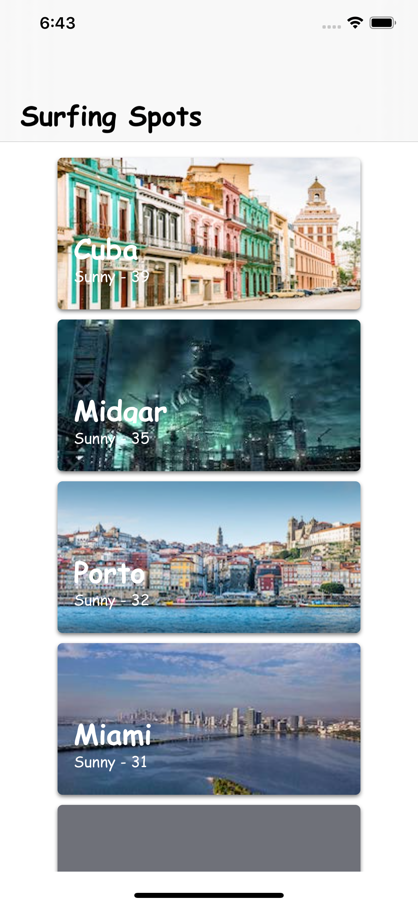

# Surfing-Spots 
This a test application for neatoRobotics iOS development role 

# Demo
The goal will be to build an app that helps users find the perfect spot to surf according to the local weather conditions.

## Getting Started 
please clone or download a copy of the project on your system 

### Prerequisites 
you need xcode 11 or higher to run the project 

### Installing 

If your are using a mac: 
- Go to the `terminal` of the mac navigate to the project directory and run `pod install`. 

- Then open `NeatoTest.xcworkspace` 

## Running the tests 
You can run the test by simply going to `Test Navigator` at *navigation pane* (usually at the left side of the xcode) and run all the tests and see the results. 

## Acknowledgments 
* This app written using ***MVP*** pattern (with seprated networking channel which is connected to presenter) 
* I used ***CoreData*** simply just to show off my ability in this topic (otherwise more simpler solutions like `userDefaults` are available ) 
* I just covered the `presenter` class for testing. First of all this class is the business logic layer of the application and most important to test; second, due to the nature of the project which is for testing reasons and has no furthure usage and of course limited timing.
